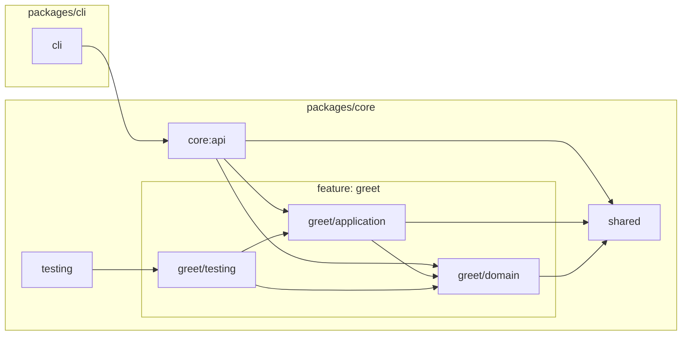

# Architecture map

> **Generated** by `pnpm arch:map` — do not edit by hand. The gate
> (`docs/architecture.spec.ts`) fails when this file drifts from the tree:
> regenerate it in the same commit as the change that reshaped the graph.

Nodes are the modules **Sheriff** verifies (`pnpm check:arch` and this map
read the same graph, so they cannot disagree); arrows are real imports,
folded to module level. A feature extracted from the nursery
([ADR-0006](adr/0006-emergent-feature-modules.md)) appears as a subgraph
the moment it exists. The map shows the graph **reachable from the entry
points** — an empty nursery or an unwired file does not appear: this is
the shipped architecture, not the aspiration.

<!-- arch:begin — generated by `pnpm arch:map`, do not edit -->

<!-- arch:end -->
